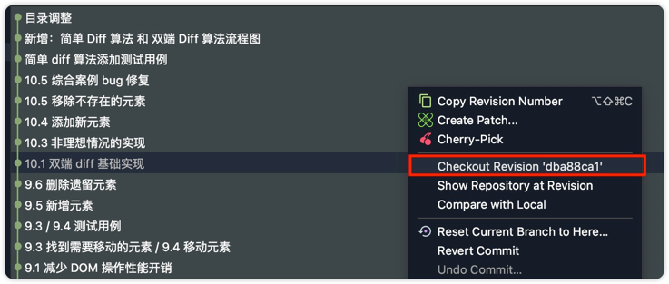
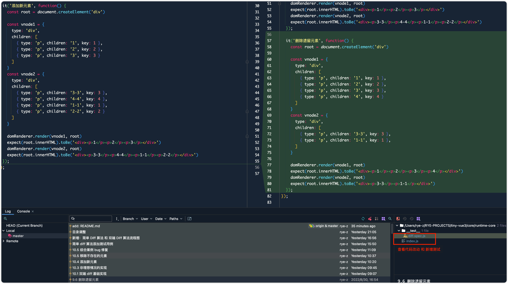
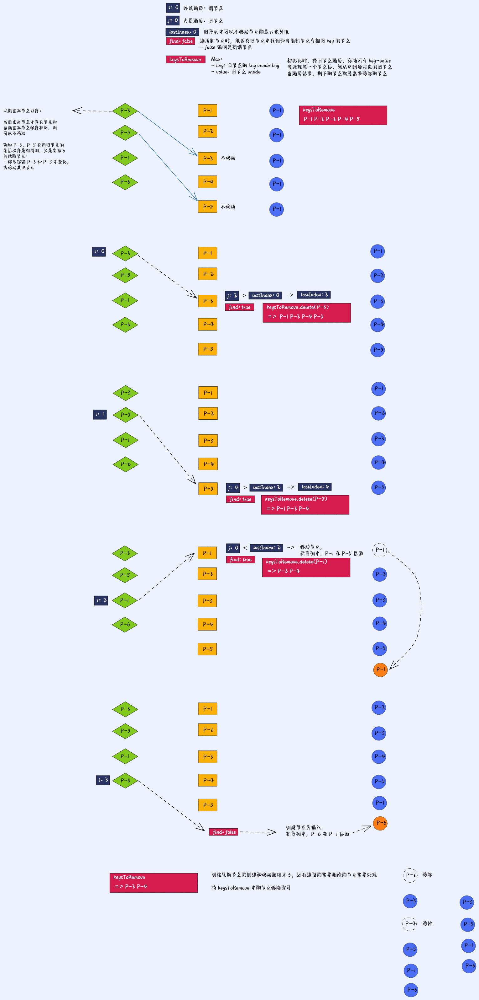

# tiny-vue3

学习《Vue.js设计与实现》时的对应代码，如果你也在看这本书，也许可以参考一下。

## 为什么要写这个项目？

### 第一点

主要是记录自己的学习过程，学啥肯定都是要自己手撸一遍的，不然怎么能说自己掌握了。

大部分 commit 都可以对应到具体的章节，通过 checkout 到具体的提交记录可以快速回顾。

### 第二点

书上给的大部分还是代码的实现思路，官方代码库 [HcySunYang/code-for-vue-3-book](https://github.com/HcySunYang/code-for-vue-3-book)，
给的也是每个章节对应的代码实现，都是单个的 `.html` 文件，没有将其当做一个项目来划分目录和功能。

我想也许可以做成一个实现最简功能的简化版 vue，所以对目录结构目录和函数功能简单做了个划分，以 core/reactivity 目录为例：
```shell
├── __test__
    ├── computed.spec.js
    ├── effect.spec.js
    ├── ref.spec.js
    ├── scheduler.spec.js
    └── watch.spec.js
├── computed.js
├── effect.js
├── reactive.js
├── ref.js
└── watch.js
```

### 第三点

想通过单元测试来保证代码功能完善。

- 在学习过程中，书上每个章节提供的都是代码片段，一般都是先理解，然后自己编码，可能不会完全按照书本上来，会出现误打误撞正巧实现了这个章节的功能，
但是可能会造成之前已经实现的功能出现异常，如果将每个章节功能分别写在不同的 `.html` 中，可能不会发现这个问题。
- 还有少部分章节的内容因为缺少部分代码而无法运行，比如 【8.8 事件冒泡和更新时机问题】，需要完成【8.9 子节点更新】的代码才可以运行。但书中没有说明，
通过编写单元测试，更容易发现当前代码的问题，从而更加关注缺失内容的处理。

使用 Jest 做了单元测试
- 将每个章节的内容尽可能写成一个或者多个单测，可以通过 commit 记录查看。
- 测试用例在每个功能模块的 `__test__` 文件中。
 
PS：有些功能实在不知道怎么用 Jest 模拟，就写在 `.html` 里面了。
- 比如：8.8 事件冒泡和更新时机问题，见 `/core/run-time/__test__/test_bubbling.html`

## 安装

```shell
git clone git@github.com:Rye-z/tiny-vue3.git
```

```shell
pnpm install
```

## 使用

一定要搭配《Vue.js设计与实现》，因为细节真的很多，看代码看不明白的。

安装之后，可以通过 git，checkout 到具体的提交记录，一般都是按照章节提交的。

如果你使用 WebStorm：



通过 git 的 diff 功能，可以查看有哪些改动以及添加了哪些单元测试，你可以自己去 run/debug 单元测试。
- 一般情况下，每个 commit 都会有对应的单元测试，对应的就是章节内容。



## 流程图

自己学习时，画的一些图，在 `/core/doc` 下，之后可能也会放一些文档。

#### 简单 Diff 算法


#### 双端 Diff 算法


